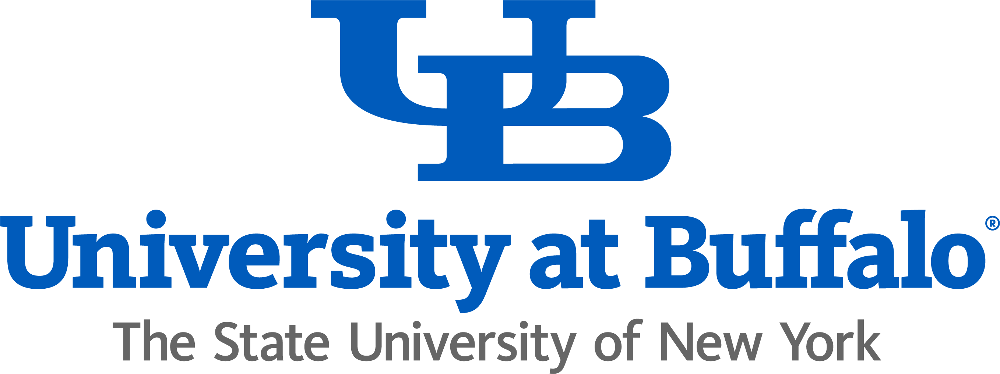

# Supply Chain Analytics (MGO 636)

## 📑 Table of Contents
- [Supply Chain Analytics (MGO 636)](#supply-chain-analytics-mgo-636)
  - [📑 Table of Contents](#-table-of-contents)
  - [👨‍🏫 Instructor](#-instructor)
  - [🧑‍🏫 Student Assistant](#-student-assistant)
  - [📌 Logistics](#-logistics)
  - [🧭 Course Overview and Objectives](#-course-overview-and-objectives)
  - [📚 Textbook](#-textbook)
  - [📘 Prerequisite or Co-requisite](#-prerequisite-or-co-requisite)
  - [💻 Course Technology](#-course-technology)
    - [UBLearns](#ublearns)
    - [Zoom](#zoom)
    - [Generative AI](#generative-ai)
    - [📢 Student Responsibilities](#-student-responsibilities)
  - [🧾 Academic Integrity](#-academic-integrity)
  - [⚠️ Course Materials Policy](#️-course-materials-policy)
  - [🌍 Diversity and Inclusion](#-diversity-and-inclusion)
  - [🏛️ Campus Resources](#️-campus-resources)
  - [📊 Grading Components](#-grading-components)
  - [📅 Course Calendar](#-course-calendar)
  - [Appendix: Guidelines for Final Project](#appendix-guidelines-for-final-project)
    - [Useful Websites for Conducting Supply Chain Research](#useful-websites-for-conducting-supply-chain-research)

## 👨‍🏫 Instructor
**Parshan Pakiman**  
Assistant Professor of Operations Management  
Department of Operations Management and Strategy  
University at Buffalo School of Management  
- 📍 Office Location: 343 Jacobs Management Center ([UB map](https://www.buffalo.edu/home/visiting-ub/map.html#JACOBS))
- 📧 Email: [ParshanP@Buffalo.edu](mailto:parshanp@buffalo.edu)  
- 🌐 Web: [ParshanPakiman.Github.io](https://parshanpakiman.github.io/)  
- 🕒 Office Hours: Fridays, 3:00 PM – 4:00 PM, or by appointment  
  - 🔗 Virtual: [https://buffalo.zoom.us/my/pakiman.office.hours](https://buffalo.zoom.us/my/pakiman.office.hours)  
  - 🏢 In-Person: 343 Jacobs Management Center

## 📌 Logistics
- 🗓️ **Semester**: Fall 2025 ([UB calendar](https://www.buffalo.edu/registrar/calendars/current-academic-calendar.html))
- 🎯 **Level**: Graduate  
- 📍 **Class Location**: Alfiero Center, Room 104 ([UB map](https://www.buffalo.edu/home/visiting-ub/map.html#CLEMEN))
- 🕒 **Class Time**: Mondays from 6:30 PM to 9:10 PM
- 🏫 **Course Mode**: In-person

## 🧭 Course Overview and Objectives

This course provides an analytical and managerial foundation for understanding and improving supply chain performance. A supply chain is a complex system involving multiple businesses, including suppliers, manufacturers, distributors, logistics providers, and retailers, working together to deliver products and services to end consumers. The course examines how supply networks are designed, managed, and coordinated to align with strategic business objectives.

Modern supply chains must adapt to globalization, digital transformation, and increasing customer expectations. We explore how advances in information technology and analytics have enabled greater efficiency and responsiveness, while also introducing new challenges related to coordination.

The course emphasizes both conceptual understanding and practical skills. Students will apply prescriptive analytics and modeling techniques to real-world supply chain problems using tools such as Excel Solver. Case studies, simulations, and group projects are used to build critical thinking, collaboration, and communication skills.

## 📚 Textbook 

- The required textbook is: *Supply Chain Management: Strategy, Planning, and Operations* (7th Edition) by Sunil Chopra (ISBN: 978-0134731889)  
- [Amazon](https://a.co/d/duJPt5g) offers multiple editions and rental options, including a paperback version which can be cheaper. You are encouraged to choose the most affordable version that covers the required content. 

**Cases and Games:**
- Required and optional case materials can be purchased at Harvard Business Publishing. Cost: $4.95 (essential) + $10 (optional materials): [https://hbsp.harvard.edu/coursepacks/1323155](https://hbsp.harvard.edu/coursepacks/1323155)
- If you do not already have a Harvard Business Publishing account, please register for a free one.
- You will participate in the eBeer Simulation game during the semester. Access instructions and play guidelines will be provided in class.

## 📘 Prerequisite or Co-requisite
None. However, the course has a significant quantitative component, including algebraic manipulations, basic calculus and probability (e.g., derivatives, simple distributions, independence), and data analysis (primarily in Excel). Familiarity with these concepts will be helpful. We will also formulate and solve optimization problems to apply the concepts learned in class. While a background in optimization is beneficial, all essential concepts will be introduced as the course progresses.

## 💻 Course Technology

### UBLearns
- The primary platform for this course is [UBLearns](http://ublearns.buffalo.edu/), which will serve as the central hub for course content, announcements, and grading.  
- Please familiarize yourself with UBLearns. You can explore its features and guides at [UBLearns Student Guide](https://www.buffalo.edu/lms/guides-students.html#title_0_copy:~:text=Quick%20Start%20Videos-,Available%20Guides,-Basics%20of%20UB)

### Zoom
- I will hold office hours both in person and online. If you prefer to attend online or schedule a virtual meeting with me, we will use Zoom. 
- Please log into your [UB Zoom](https://www.buffalo.edu/ubit/services/zoom.html) account before joining. You can access my scheduled Zoom meeting at https://buffalo.zoom.us/my/pakiman.office.hours.

### Generative AI
Generative AI tools (e.g., ChatGPT, Claude, Gemini) can support your learning, but they must be used **ethically and responsibly**. 

✅ **Permitted Uses**  
- Clarifying course concepts or terminology.  
- Brainstorming ideas, examples, or alternative approaches.  
- Practicing with additional problems or quizzes generated by AI.  
- Improving clarity, grammar, or formatting of your own writing.  

🚫 **Not Permitted**  
- Using AI to complete homework, quizzes, or exams.  
- Submitting any AI output as your own original work.  
- Using AI to generate code, formulas, or problem solutions you do not fully understand.  

⚠️ **Required Practice**  
- **Attempt first:** Always create your own draft or solution before using AI.  
- **Ask specifically:** Use AI to answer targeted questions or explain concepts, not to “do the work.”  
- **Acknowledge use:** Whenever you use an AI tool, include a brief *AI Use Statement* in your submission.  
  For example:  
  > I used ChatGPT to clarify the formula of return on equity.  
- **Verification:** The instructor and student assistant may use AI-detection tools to help determine whether submitted work is AI-generated or written by the student. Misrepresenting AI-generated work as your own is considered academic fraud. Read more at the [UB Academic Integrity – Artificial Intelligence](https://www.buffalo.edu/academic-integrity/about/artificial-intelligence.html) page.

### 📢 Student Responsibilities
1. Ensure you have access to **UBLearns** and **Zoom** from the very beginning of the semester. Log in and familiarize yourself with both platforms as soon as possible.  
2. Install Excel and [Excel Solver](https://support.microsoft.com/en-us/office/load-the-solver-add-in-in-excel-612926fc-d53b-46b4-872c-e24772f078ca) on your machine. 
3. Check **UBLearns** and your **UB email** regularly for course updates and announcements.  
4. Stay current with class lectures — this is key to earning a good grade.   
5. All material covered in lectures is also included in your assigned readings. Your textbook remains your most reliable reference and should always be accessible.  
6. 🚫 Eating or drinking is not permitted during class sessions.  
7. 📧 All email communications must include **"MGO-636"** in the subject line to ensure a timely response.

## 🧾 Academic Integrity
- Academic integrity is essential to your learning and to UB’s academic standards.  
- You are expected to complete all work honestly and independently.  
- Misrepresenting someone else’s work as your own is academic fraud.  
- Refer to the [UB Undergraduate Handbook](http://mgt.buffalo.edu/programs/undergrad/handbooks/handbook) for detailed policies.

## ⚠️ Course Materials Policy
- Do not share, upload, reproduce, or distribute materials without written permission.  
- Violations may result in disciplinary action under UB’s Academic Integrity Policy and Code of Conduct.

## 🌍 Diversity and Inclusion
- Maintain professionalism and respect in all interactions.  
- Discriminatory language or behavior is not tolerated.  
- Respect UB’s diverse learning community.  
- Learn more: [UB Inclusive Excellence Resources](http://www.buffalo.edu/inclusion/resources/IXResources.html)

## 🏛️ Campus Resources
- Your well-being is vital—please reach out if you need support.  
- I’m also available if you need help navigating resources.  
- ♿ **Accessibility**: Contact the Office of Accessibility Resources (60 Capen Hall, 716-645-2608). [More Info](http://www.buffalo.edu/studentlife/who-we-are/departments/accessibility.html)  
- 🔐 **Sexual Violence Support**: Title IX (716-645-2266), Confidential Advocate (716-796-4399)  
- 🧠 **Mental Health**: Counseling (716-645-2720), Health Services (716-829-3316), Health Promotion (716-645-2837)

## 📊 Grading Components

1. **Participation (5%)**  
- Participation goes beyond simply attending class, but attendance is required to obtain a high participation score.  
- You are expected to complete all assigned readings and cases before class, understand your group’s answers to all questions, and be prepared to discuss them.  
- Active engagement throughout the session is essential. The **quality** of your contributions, rather than their frequency, is the key criterion for effective participation.  
- The instructor has full discretion in determining your participation grade.  

2. **Individual Homeworks and Group Assignments (30%)**  
- There will be **four individual homeworks**, each worth **2.5%** of your overall grade.  
  - Collaboration is **not** allowed.  
  - Each student must submit their own write-up in **PDF format** via **UBLearns**.  
- There will be **four group assignments**, each worth **5%** of your overall grade.  
  - Students should form groups of **4–5 members**. You may not work alone.  
  - One group member will submit a single write-up in **PDF format** via **UBLearns**.  
- All submissions must clearly list the **full name** and **UB email** of **every group member** or **individual submitter** at the top of the PDF file.  
- All assignments are due by **6:00 PM** on the due date, which will be posted on UBLearns, in **PDF format**.  
- ❌ **No credit** will be given for late submissions.  

3. **Midterm 1 (15%)**  
- Administered at the beginning of Week 6.  
- Covers Chapters 1–6, including materials on Supply Chain Drivers, Metrics, and Network Design.  

4. **Midterm 2 (20%)**  
- Administered at the beginning of Week 13.  
- Covers Chapters 9, 11, 12, and 13, focusing on Linear Programming and Inventory Control.  

> ⚠️ **Arrive on time** — no extra time will be given for late arrivals, as new material will be taught during the second half of the class.  
> ⚠️ **Make-up exams** will only be granted for documented medical emergencies or unavoidable circumstances.  

5. **Final Project (30%)**  
- Every **4–5 students** will work together on a final project in the form of either a Case Study or a White Paper.  
- **Final Project Presentation (10%):** In our final session on **Monday, December 8, 2025**, each group will present their project to the class.  
- **Final Project Report (20%):** Each group should submit a written report on our course exam date of **Friday, December 12, 2025**, by **6:00 PM** via **UBLearns**. No extensions will be granted due to grading-time constraints.

> Please see [Appendix: Guidelines for Final Project](#appendix-guidelines-for-final-project) for details.

---

## 📅 Tentative Course Calendar

| Week | Date         | Topic                                                     | Reading Assignment                                    | Deliverables                                                                 | Notes |
|------|--------------|-----------------------------------------------------------|-------------------------------------------------------|-------------------------------------------------------------------------------|-------|
| 1    | Aug 25       | Understanding Supply Chains                               | Syllabus; Chapters 1 & 2                              | —                                                                             |       |
| 2    | Sep 1        | Labor Day                                       | 7-11 Japan case (end of Chapter 3)                    | Final project team formation – submit member names |   No class meeting    |
| 3    | Sep 8        | Supply Chain Drivers and Networks                         | Chapters 3 & 4                                        | Individual Homework 1: Blockbuster Case (end of Chapter 2) |       |
| 4    | Sep 15       | Network Design in the Supply Chain                        | Chapters 5 & 6                                        | Individual Homework 2: Blue Nile Case (end of Chapter 4); Finalize your final project topic |       |
| 5    | Sep 22       | Supply Chain Forecasting          | Chapters 7                                       | Individual Homework 3: Coolwipes Case (end of Chapter 5) |       |
| 6    | Sep 29       | **Midterm 1** + Linear Programming                        | Chapter 9                                             | **Midterm 1** | Midterm 1 covering Chapters 1–6, administered in first part of class |
| 7    | Oct 6        | Inventory Control: Cycle Inventory                        | Chapter 11                                            | Group Assignment 1: BioPharma Case (end of Chapter 6) |       |
| 8    | Oct 13       | Fall Break                                                | —                                                     | Final project proposal due on UBLearns | No class meeting |
| 9    | Oct 20       | Inventory Control: Safety Inventory                       | Chapter 12                                            | Group Assignment 2: Mintendo Game Girl (end of Chapter 9) |       |
| 10   | Oct 27       | Inventory Control: Seasonal Inventory                     | Chapter 13                                            | Individual Homework 4: Bakery Production (UBLearns) |       |
| 11   | Nov 3        | Transportation Networks and Last Mile Delivery            | Chapter 14                                            | Group Assignment 3: ALKO Case (end of Chapter 12) |       |
| 12   | Nov 10       | Supply Chain Information                                  | Chapter 10 + eBeer Game                               | —                                                                             | In-class eBeer Game |
| 13   | Nov 17       | **Midterm 2** + The Bullwhip Effect                        | Chapter 15                                            | **Midterm 2** | Midterm 2 covering Chapters 9, 11, 12, 13, administered in first part of class |
| 14   | Nov 24       | The Bullwhip Effect (cont.)                                | Chapter 15                                            | Group Assignment 4: Barilla SpA Case (HBS Case Pack) |       |
| 15   | Dec 1        | Pricing and Revenue Management                            | Chapter 16                                            | —                                                                             |       |
| 16   | Dec 8        | Final Project Presentations                               | —                                                     | Presentations (~10 min per group, Q&A included) |       |
| —    | Dec 12       | Final Project Report Due                                  | —                                                     | Submit on UBLearns by 6:00 PM (PDF format; max 10 pages + appendix) | No extensions |

<!-- | Week | Date         | Topic                                                     | Reading Assignment                                    | Deliverables                                                                 | Notes |
|------|--------------|-----------------------------------------------------------|-------------------------------------------------------|-------------------------------------------------------------------------------|-------|
| 1    | Aug 25       | Understanding Supply Chains                               | Syllabus; Chapters 1 & 2                              | —                                                                             |       |
| 2    | Sep 1        | Labor Day                                       | 7-11 Japan case (end of Chapter 3)                    | Final project team formation – submit member names |   No class meeting    |
| 3    | Sep 8        | Supply Chain Drivers and Networks                         | Chapters 3 & 4                                        | Individual Homework 1: Blockbuster Case (end of Chapter 2) |       |
| 4    | Sep 15       | Network Design in the Supply Chain                        | Chapters 5 & 6                                        | Individual Homework 2: Blue Nile Case (end of Chapter 4); Finalize your final project topic |       |
| 5    | Sep 22       | Supply Chain Forecasting and Aggregate Planning           | Chapters 7 & 8                                        | Individual Homework 3: Coolwipes Case (end of Chapter 5) |       |
| 6    | Sep 29       | **Midterm 1** + Linear Programming                        | Chapter 9                                             | **Midterm 1** | Midterm 1 covering Chapters 1–6, administered in first part of class |
| 7    | Oct 6        | Inventory Control: Cycle Inventory                        | Chapter 11                                            | Group Assignment 1: BioPharma Case (end of Chapter 6) |       |
| 8    | Oct 13       | Fall Break                                                | —                                                     | Final project proposal due on UBLearns | No class meeting |
| 9    | Oct 20       | Inventory Control: Safety Inventory                       | Chapter 12                                            | Group Assignment 2: Mintendo Game Girl (end of Chapter 9) |       |
| 10   | Oct 27       | Inventory Control: Seasonal Inventory                     | Chapter 13                                            | Individual Homework 4: Bakery Production (UBLearns) |       |
| 11   | Nov 3        | Transportation Networks and Last Mile Delivery            | Chapter 14                                            | Group Assignment 3: ALKO Case (end of Chapter 12) |       |
| 12   | Nov 10       | Supply Chain Information                                  | Chapter 10 + eBeer Game                               | —                                                                             | In-class eBeer Game |
| 13   | Nov 17       | **Midterm 2** + The Bullwhip Effect                        | Chapter 15                                            | **Midterm 2** | Midterm 2 covering Chapters 9, 11, 12, 13, administered in first part of class |
| 14   | Nov 24       | The Bullwhip Effect (cont.)                                | Chapter 15                                            | Group Assignment 4: Barilla SpA Case (HBS Case Pack) |       |
| 15   | Dec 1        | Pricing and Revenue Management                            | Chapter 16                                            | —                                                                             |       |
| 16   | Dec 8        | Final Project Presentations                               | —                                                     | Presentations (~10 min per group, Q&A included) |       |
| —    | Dec 12       | Final Project Report Due                                  | —                                                     | Submit on UBLearns by 6:00 PM (PDF format; max 10 pages + appendix) | No extensions | -->

## Appendix: Guidelines for Final Project

The final project is a **group assignment** that can take one of two formats:  
  1. **Case Study:** Analyze an existing supply chain process and propose improvements. A case study may also identify opportunities for new business models.  
  2. **White Paper:** Examine a supply chain practice in industry, describing its risks, benefits, best practices, and industry examples.

**Five Key Steps:**

1. **Form Your Team** – Create **groups of three** by the end of **Week 2**.  
2. **Choose a Topic** – Consult with me early to confirm your project scope. By the end of **Week 4**, your topic should be finalized so you can focus on research and analysis.  
3. **Submit Proposal** – A one-page (double-spaced, font size 11) project proposal must be submitted on **UBLearns** by **Week 8**.  
4. **Present Your Work** – In our final class session (**Monday, December 8, 2025**) during **Week 16**, each group will have approximately **10 minutes** to present their findings and respond to Q&As.  
5. **Submit Final Report** – Prepare a written executive report that identifies opportunities and recommends actionable improvements based on the chosen supply chain concepts. The report should be maximum of 10 pages (double-spaced, font size 11). Include figures and exhibits in an appendix if needed.

**Potential Topics:**
- Use of AI in supply chain contracting, forecasting, or optimization   
- Green or sustainable supply chain management (e.g., recycling, re-manufacturing, returns)  
- Service supply chain management (e.g., service outsourcing and management issues, healthcare, etc.)  
- Supply chain for product safety (e.g., initiatives to ensure product safety)   
- Supply chain management for disaster relief  

**Useful Websites for Conducting Supply Chain Research**

### Useful Websites for Conducting Supply Chain Research

- **Council of Supply Chain Management** – [http://www.cscmp.org/](http://www.cscmp.org/)  
  The largest professional organization focused on supply chain management. Includes a comprehensive glossary, industry news, and recent case studies.

- **University of Tennessee’s Industry-Focused White Papers** – [https://haslam.utk.edu/gsci/research/white-papers](https://haslam.utk.edu/gsci/research/white-papers)  
  A collection of industry-focused white papers covering supply chain strategy, operations, and best practices.

- **The McKinsey Quarterly** – [https://www.mckinsey.com/quarterly/overview](https://www.mckinsey.com/quarterly/overview)  
  In-depth global supply chain studies and strategic insights. Free registration required.

- **Logistics** – [http://www.inboundlogistics.com/](http://www.inboundlogistics.com/)  
  Links to numerous logistics-related resources, best practices, and industry case studies.

---
**Note:** The instructor gratefully acknowledges the guidance and resources provided by faculty across UB, UChicago, and UIC in preparing this course.

